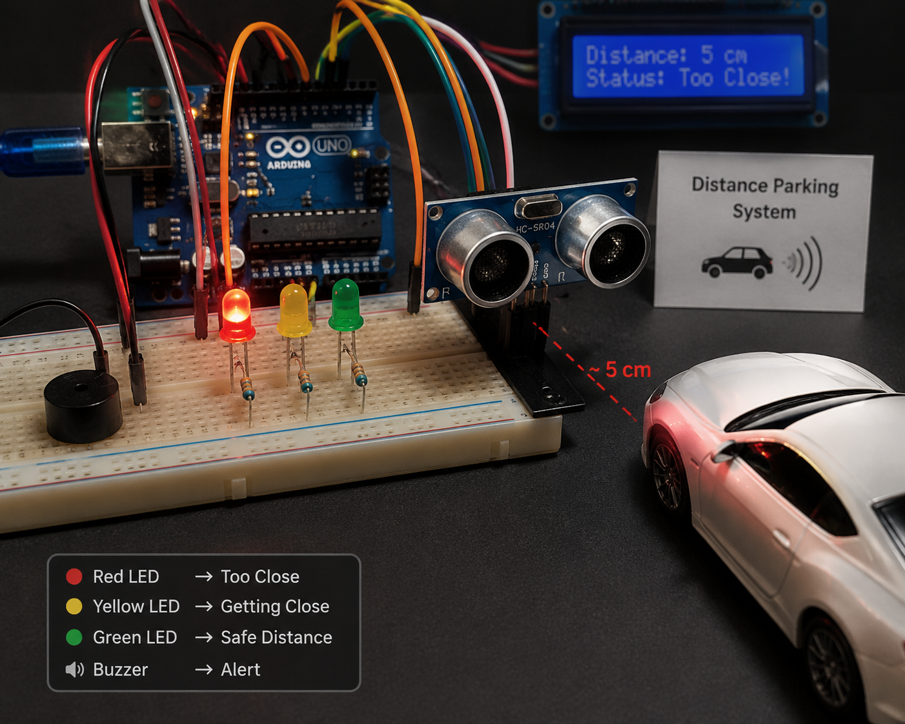
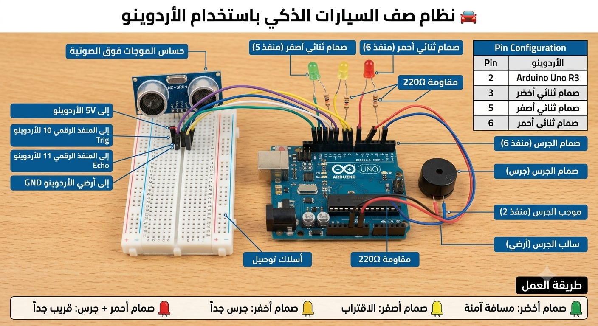

# 🚗 Arduino Distance Parking System

## 📌 Overview
This project is an Arduino-based parking assistant system that uses an ultrasonic sensor to measure distance and help drivers park safely using LEDs and a buzzer.

---

## 📷 Project Preview

### 🔧 Circuit Diagram

### 💡 Real Setup

---

## ⚙️ Components
- Arduino board (UNO or similar)
- Ultrasonic Sensor (HC-SR04)
- 3 LEDs (Red, Yellow, Green)
- Buzzer
- Resistors (220Ω)
- Jumper wires

---

## 🔌 Pin Configuration (مهم ركز هنا 🔥)

| Component        | Arduino Pin |
|-----------------|------------|
| Trig (Sensor)   | 10         |
| Echo (Sensor)   | 11         |
| Red LED         | 6          |
| Yellow LED      | 5          |
| Green LED       | 3          |
| Buzzer          | 2          |

---

## 💡 How it works
The system measures the distance between the car and an object:

- 🟢 Green LED → Safe distance  
- 🟡 Yellow LED → Getting close  
- 🔴 Red LED + Buzzer → Too close  

---

## ▶️ Usage
1. Upload the code to Arduino  
2. Power the system  
3. Move an object closer or farther to test  

---

## 📁 Project Structure
